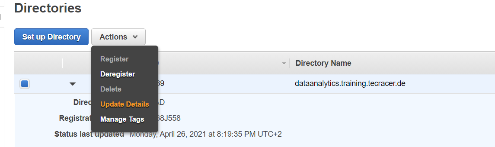
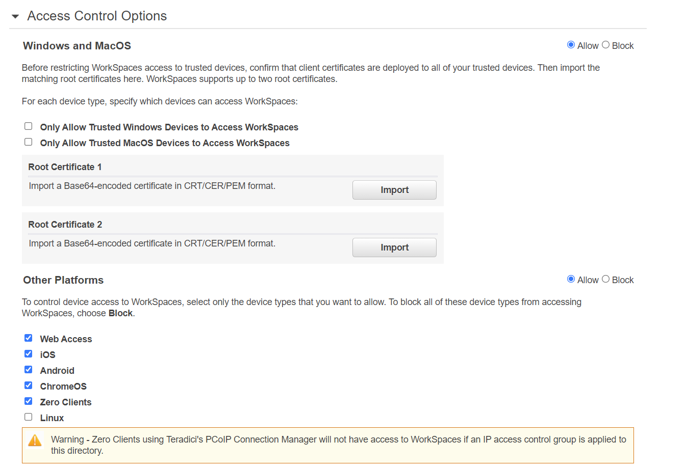
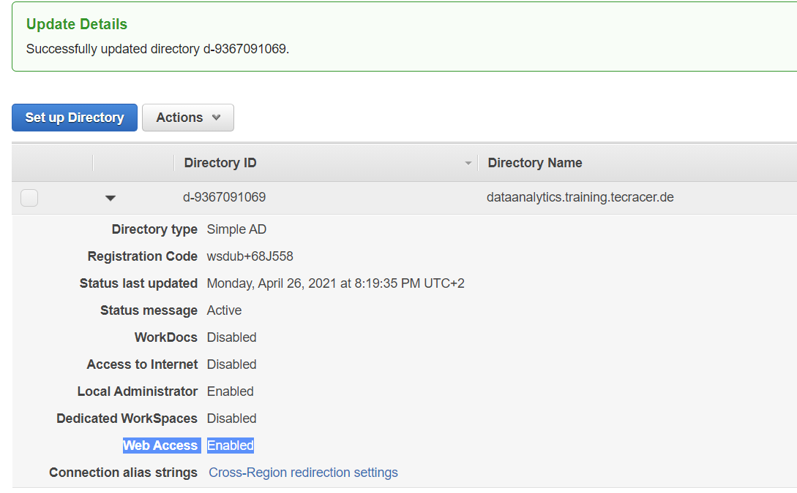
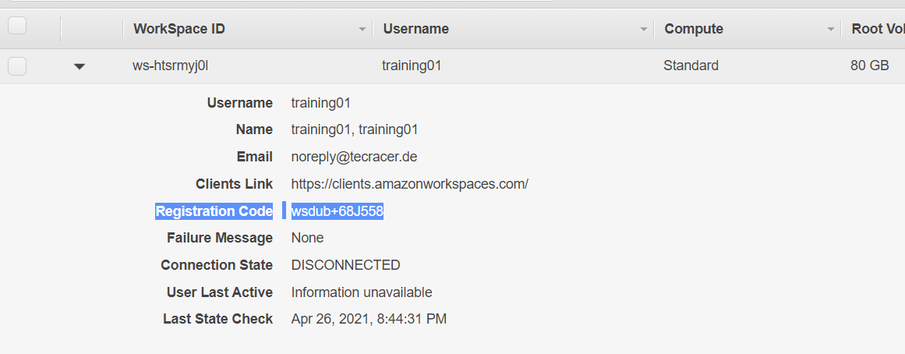

# Training Workspace Creation

This CDK Project allows automatic creation of all ressources required for a training lab environment using AWS workspaces.

## Prerequisite:
- An existing VPC with private subnets needs to exist. Those private subnets require access to AWS API Endpoints (e.g. via NAT Gateway)
- NPM and CDK need to be installed on your local maschine
- obtain AWS authorizations via CLI (e.g. via awsume)

## How to deploy
1. Copy the *example.env* file to *.env* and modify the required parameters
```
AWS_USER_AMOUNT=4
AWS_BUNDLEID=wsb-8vbljg4r6
```

AWS_USER_AMOUNT refers to the amount of users to create. They will be called training01 - training 0n (password for each is username + !).

AWS_BUNDLEID refers to a AWS Workspaces Bundle that needs to be provided. Check the AWS documentation to find out more.


2. install dependencies 
```
npm install
```
3. run
```
cdk deploy
```
4. approve deployment
```
Do you wish to deploy these changes (y/n)?
```

## Verify Deployment

Deployment will take some time (5 - 10 minutes).
Afterwards you can verify it by checking the following in AWS Console:

1. If Directory Registration was sucessful

    https://eu-west-1.console.aws.amazon.com/workspaces/home?region=eu-west-1#directories:directories

2. Make sure that web access is possible (expand directory to view )

    **Unfortunately, there is a bug in the Workspaces API. Therefore it is currently required to perform a manual activity after deployment. The bug is already addressed to AWS support.**

    1. Access Settings on Directories Page
    
    2. Open Access Control Options
    
    3. **Uncheck** *Web Access* and Save/Update
    4. **Check** *Web Access* again and Save/Update
    5. Verify that web access is active now on overview page
     
    6. You might need to 


2. Check if Workspaces were created

    https://eu-west-1.console.aws.amazon.com/workspaces/home?region=eu-west-1#listworkspaces

    Workspaces stay in pending state until they are finally accessible.
    Here, you also find the Registration Code, that the users require to log in.
    
    
    

   


    Default Password of the users are username + "!"

    Web Access is possible via the following Link:
    https://clients.amazonworkspaces.com/webclient

